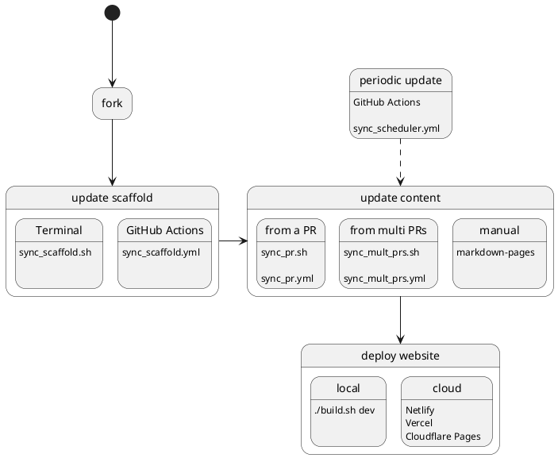

# Overview

<a href="https://github.com/Oreoxmt/pingcap-docsite-preview" summary="Preview doc changes before merging a pull request"><code>pingcap-docsite-preview</code></a> is a tool designed for previewing changes to <a href="https://docs.pingcap.com">PingCAP documentation website</a> before merging pull requests. It enables you to:

- **Validate document updates** without affecting the official website.
- **Collaborate with reviewers** by sharing a preview link.
- Verify the **accurate rendering** of changes before merging them into the production website.
- Achieve **consistent** preview results that match the official website.

## Key features

- **Ease of use**: preview a PR by simply creating a new branch.
- **Cross-repository preview**: simultaneously preview changes from multiple PRs across different repositories.
- **Centralized preview schedule management**: organize and manage preview schedules in a unified workflow.
- **Customizability**: customize the preview process to meet your requirements.

## Scope

<a href="https://github.com/Oreoxmt/pingcap-docsite-preview" summary="Preview doc changes before merging a pull request"><code>pingcap-docsite-preview</code></a> supports previewing documentation for <a href="https://docs.pingcap.com/tidb/stable">TiDB</a>, <a href="https://docs.pingcap.com/tidbcloud">TiDB Cloud</a>, and <a href="https://docs.pingcap.com/tidb-in-kubernetes/stable">TiDB Operator</a>. You can preview PRs from the following repositories:

- [`pingcap/docs`](https://github.com/pingcap/docs)
- [`pingcap/docs-cn`](https://github.com/pingcap/docs-cn)
- [`pingcap/docs-tidb-operator`](https://github.com/pingcap/docs-tidb-operator)

## Usage scenarios

- [Preview and validate minor changes in 2 minutes.](https://pdp.oreo.life/usage-scenarios#local-preview-for-minor-changes)
- [Preview a PR and collaborate with reviewers.](https://pdp.oreo.life/usage-scenarios#preview-a-pr)
- [Preview multiple PRs across different repositories.](https://pdp.oreo.life/usage-scenarios#preview-multiple-pr-changes)

## Steps to preview document changes

To preview document changes, perform the following steps:

1. Fork the <a href="https://github.com/Oreoxmt/pingcap-docsite-preview" summary="Preview doc changes before merging a pull request"><code>pingcap-docsite-preview</code></a> repository.
2. Update the **scaffold** of <a href="https://docs.pingcap.com">PingCAP documentation website</a>, including version selection, table of contents, index pages, and the homepage.

    For more information, see [Update scaffold](https://pdp.oreo.life/update-scaffold).

3. Update the documentation **content** you want to preview.

    For more information, see [Update content](https://pdp.oreo.life/update-content).

4. **Deploy** the preview website either locally or on a static hosting service.

    For more information, see [Deploy your website](https://pdp.oreo.life/deploy-docsite).
